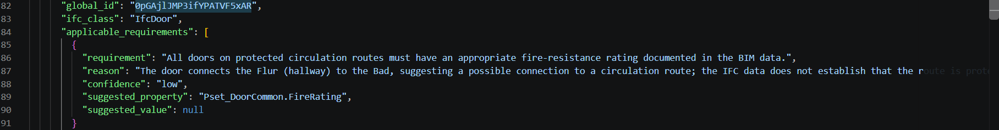

# Semantic BIM Enrichment — Proof of Concept

A small proof of concept exploring how AI can help connect **structured BIM/IFC data** with **unstructured technical project requirements**.

The objective is not to automate compliance decisions, but to investigate how semantic information could be proposed for BIM objects while preserving **uncertainty, traceability and human validation**.

## The problem

BIM models contain structured information about building objects: walls, doors, windows, slabs, properties, classifications and relationships.

However, a significant part of project knowledge remains stored in unstructured sources such as:

- technical specifications;
- requirements documents;
- project documentation;
- standards and contractual information.

This project explores one question:

> **Can an AI system identify which textual requirements may be relevant to specific BIM objects by using the information contained in an IFC model?**

## Architecture

```text
IFC Model                    Technical Requirements
    │                               │
    ▼                               ▼
IfcOpenShell                     Text input
    │                               │
    ▼                               ▼
Structured BIM data ───────► Semantic analysis
                                  │
                     ┌────────────┴────────────┐
                     ▼                         ▼
            Deterministic baseline      LLM-assisted analysis
                     │                         │
                     └────────────┬────────────┘
                                  ▼
                         Suggested enrichment
                                  │
                                  ▼
                     Confidence + explanation
                                  │
                                  ▼
                          Human validation
```

## Technologies

- Python
- IFC4
- IfcOpenShell
- OpenAI API
- JSON / CSV
- LLM-assisted semantic analysis

## Method

The proof of concept compares two approaches applied to the same BIM data.

### 1. Deterministic baseline

The first implementation uses simple rules based primarily on the IFC object class and keywords found in the technical requirements.

Example:

```text
IfcDoor
   ↓
Search requirements mentioning doors
   ↓
Associate matching requirement
```

This approach is deterministic and easy to audit, but it does not understand the context in which the BIM object exists.

### 2. LLM-assisted semantic analysis

The second implementation provides the LLM with:

- the IFC object type;
- its available properties;
- contextual BIM data;
- the technical requirements.

The model is explicitly instructed to:

- avoid inventing unavailable information;
- identify potentially applicable requirements;
- explain its reasoning;
- report a confidence level;
- suggest an IFC/BIM property when appropriate;
- leave the final decision to a human reviewer.

## Experiment — same BIM object, different behaviour

A door from the IFC model was analysed using both approaches.

Object:

```text
GlobalId: 0pGAjlJMP3ifYPATVF5xAR
IFC class: IfcDoor
Name: Innentuer-2
```

### Deterministic baseline

The baseline automatically associated the following requirement with the door:

> All doors on protected circulation routes must have an appropriate fire-resistance rating documented in the BIM data.

The association was made because the object was an `IfcDoor`.

However, this does **not** prove that the door actually belongs to a protected circulation route.


This illustrates a potential **false positive** caused by overly simple matching rules.

### LLM-assisted analysis

For the exact same BIM object, the LLM returned a more contextual result.

It detected that the door connects to a hallway (`Flur`), making the fire-resistance requirement potentially relevant.

However, it also explicitly identified that the IFC data did **not establish that this hallway was a protected circulation route**.

The result therefore included:

```text
confidence: low
suggested property: Pset_DoorCommon.FireRating
suggested value: null
```



Instead of declaring the requirement applicable, the model identified it as a **candidate requirement requiring additional evidence and human validation**.

## Initial observation

| Capability | Deterministic baseline | LLM-assisted approach |
|---|---|---|
| Uses IFC object class | Yes | Yes |
| Uses contextual properties | Very limited | Yes |
| Understands conditional wording | No | Partially |
| Provides explanation | No | Yes |
| Represents uncertainty | No | Yes |
| Can still produce incorrect results | Yes | Yes |
| Requires human validation | Yes | Yes |

This experiment **does not demonstrate that an LLM is globally more accurate than deterministic rules**.

It only demonstrates that, for the examples observed in this prototype, semantic analysis can take additional contextual information into account and explicitly represent uncertainty.

A proper comparison would require a labelled test dataset and systematic evaluation.

## BIM data exploration

IfcOpenShell is used to extract structured information from the IFC model.

Example IFC properties encountered during the experiment included:

```text
Object class: IfcWallStandardCase
Space: Wohnen
Layer: Innenwände
Type: Wand
Material: Leichtbeton
Structural function: Not defined
Renovation status: Existing
```

This illustrates an important characteristic of BIM:

> A BIM model is not only geometry. It is also a structured information system containing data that can potentially be analysed programmatically.

## Why validation matters

Generative AI should not be treated as a source of truth for BIM, engineering or regulatory decisions.

The intended architecture therefore follows this principle:

```text
AI suggestion
      ↓
Evidence + explanation
      ↓
Confidence level
      ↓
Automated validation where possible
      ↓
Human review
```

My background in software quality and test automation makes the **validation layer** particularly interesting to me.

A future version of the project could investigate not only how AI generates BIM information, but also how its outputs can be systematically tested.

## Current limitations

This is intentionally a small exploratory proof of concept.

Current limitations include:

- the technical specification is synthetic;
- requirements are currently stored in a simple text file;
- only a limited number of IFC object classes are analysed;
- there is no document retrieval pipeline yet;
- there is no RAG implementation yet;
- generated associations are not evaluated against a labelled reference dataset;
- the system does not write information back into the IFC model;
- relationships and spatial context are only partially exploited;
- LLM outputs may still contain incorrect interpretations;
- human validation remains mandatory.

## Possible next steps

### 1. Technical-document ingestion

Process PDF specifications and other project documents instead of a manually prepared text file.

### 2. Retrieval-Augmented Generation

Add a RAG pipeline to retrieve only the relevant passages before semantic analysis.

### 3. Source traceability

Associate each proposed BIM enrichment with:

```text
Document
→ page / section
→ source passage
→ proposed BIM property
→ confidence
```

### 4. Automated evaluation

Create a manually labelled dataset and evaluate:

- true positives;
- false positives;
- false negatives;
- precision;
- recall.

### 5. BIM quality validation

Combine AI-assisted enrichment with deterministic BIM rules to automatically verify whether required properties are present and correctly structured.

### 6. IFC write-back

After human approval, write validated information into a copy of the IFC model.

### 7. User interface

Create a lightweight interface showing:

```text
BIM object
+
AI suggestion
+
source evidence
+
confidence
+
validation status
```

## Professional context

My background combines three domains:

**Architecture × Software Engineering / QA Automation × BIM**

I initially trained as an architect before moving into software quality and test automation, where I worked on automated testing, APIs, data flows and reliability of complex software systems.

I am currently completing a Specialized Master in BIM and exploring the convergence between:

**BIM · automation · data · computational design · artificial intelligence for AEC**

This project represents an initial exploration of that direction.

## Disclaimer

This repository is an exploratory proof of concept developed for learning and research purposes.

It does **not** perform regulatory or engineering compliance checking, and its outputs must not be considered authoritative technical decisions.